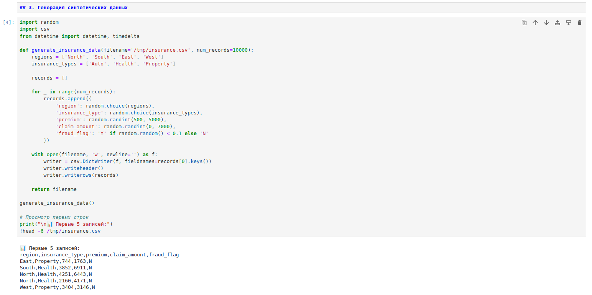
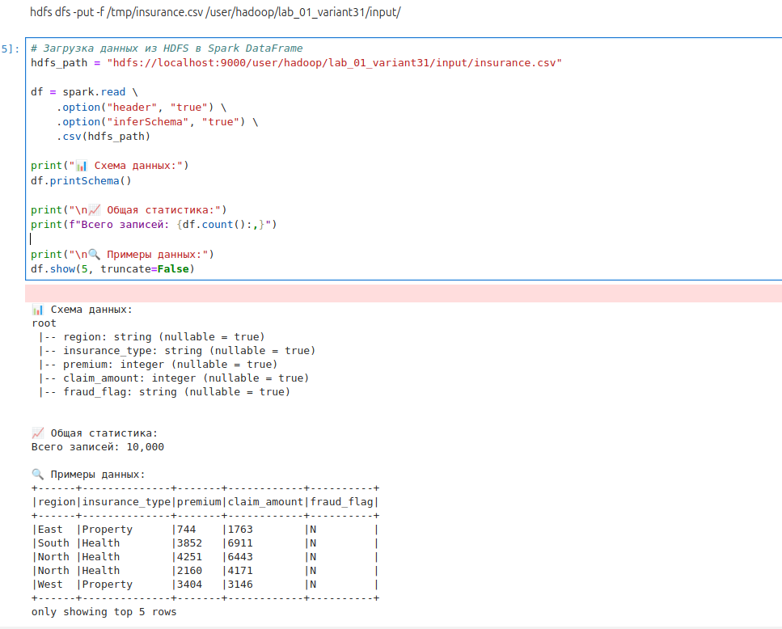
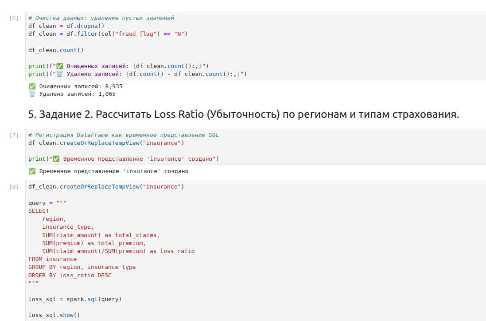
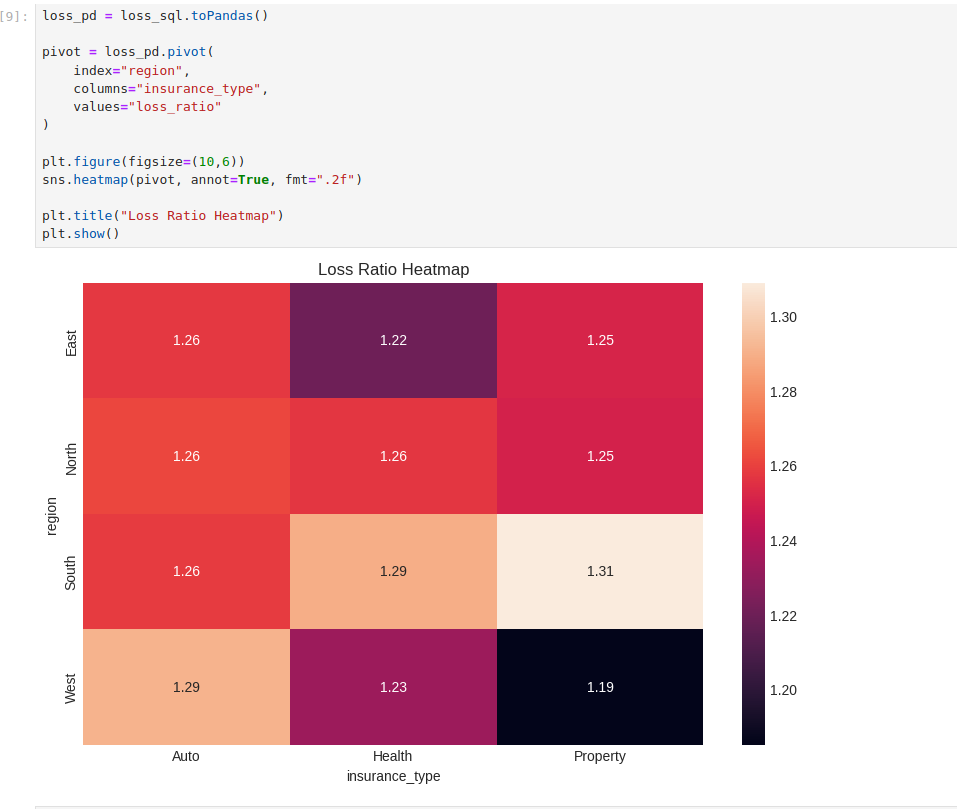
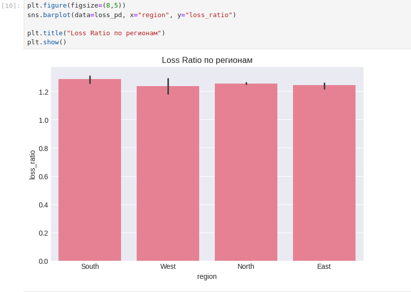
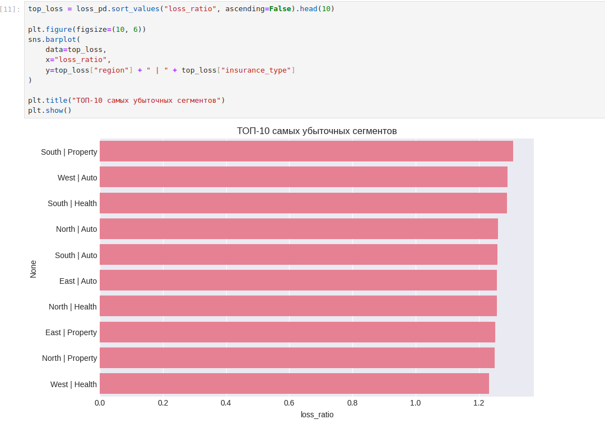
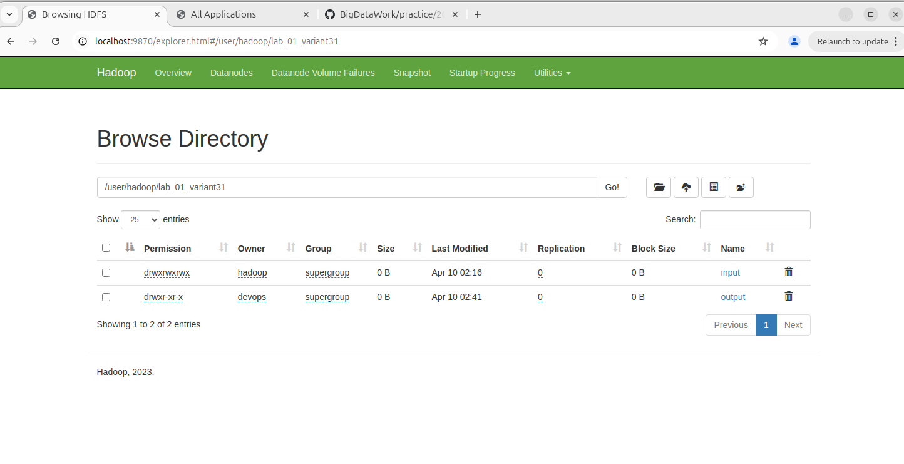

# Отчет по Практическая работа 1. Обработка и анализ данных с использованием Apache Spark (PySpark).

**Студент:** Циприков Денис

**Группа:** БД_251м

**Вариант:** 31

Генерация данных

Загрузка данных в hadoop

Фильтрация. Задание 2

heatmap

barplot

Топ 10 показателей

Сохранение итогов в hadoop

Итог в hadoop

