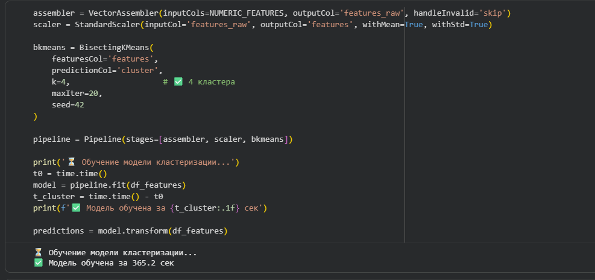
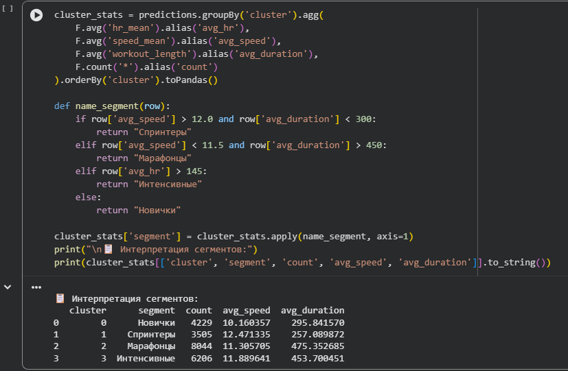
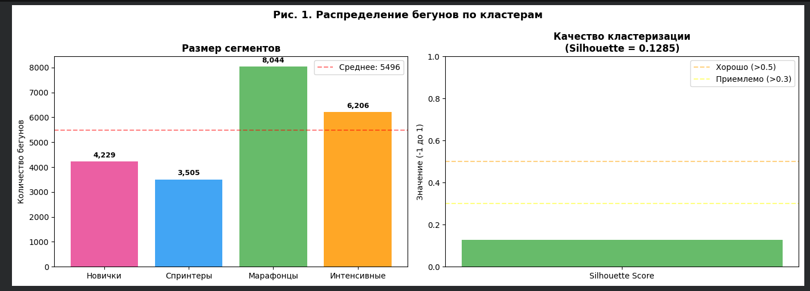
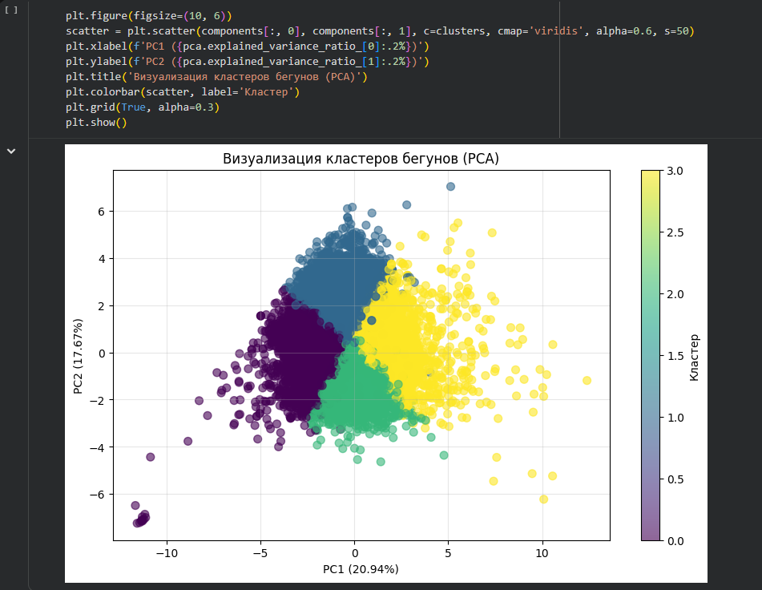
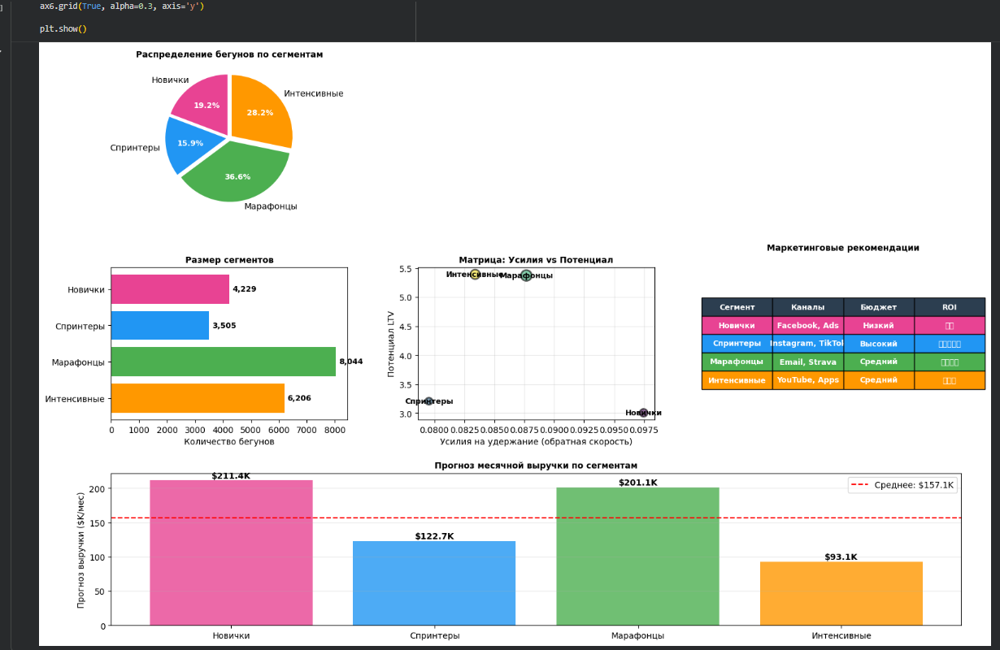
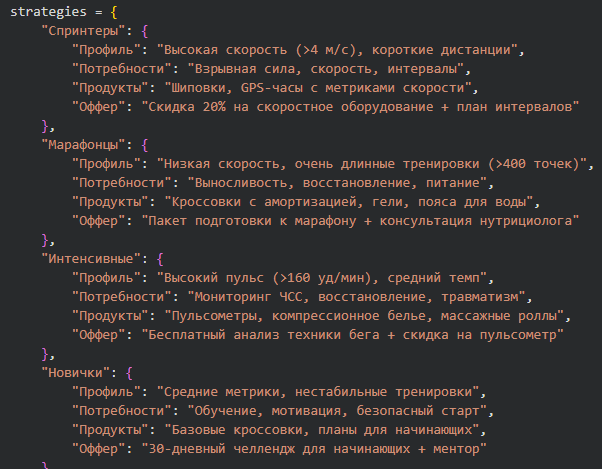

# Отчет по Практическая работа 1. Обработка и анализ данных с использованием Apache Spark (PySpark).

**Студент:** Циприков Денис

**Группа:** БД_251м

По списку Вариант 31 для задания выбрал вариант 11.

Признаки: все доступные числовые метрики (пульс, скорость, высота). Данные: только 'running'.	

Задача Кластеризации. Модель: Bisecting K-Means (k=4).	

Сегментация бегунов: "Спринтеры", "Марафонцы", "Новички". Предложите маркетинговую стратегию для каждого сегмента.

Кластеризация

Сегменты

Распределение по сегментам

РСА

Дашборд

Маркетинговые стратегии

